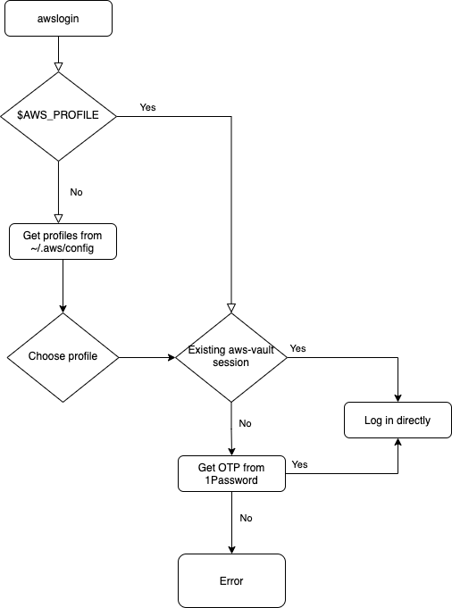

# AWS Login Tool

This is a tool used to log into AWS accounts using 1Password MFA tokens.

## Prerequisites

Before using this tool you must install these prerequisites:

* [1Password Command Line Tool](https://support.1password.com/command-line-getting-started/) @ version 1.11.4 or later
* [aws-vault](https://github.com/99designs/aws-vault) @ version v6.3.1 or later

Supported web browsers include:

* Chrome
* Chrome Canary
* Safari
* Firefox

You must then sign into 1Password at least once using the `op` command. Also include a `--shorthand` for future use.

```sh
op signin defense-digital-service.1password.com first.last@dds.mil --shorthand dds
```

For this to work you must have at least one `login` category entry in your 1Password vault. It needs a `one-time password` section as well
as a custom section named `ACCOUNT_INFO`. Additionally, one of the items in the section needs to be `ACCOUNT_ALIAS`. These can be configured
to the user's desire. As an example:


## Build the package

To build the package and use it you can run

```sh
make bin/awslogin
```

The binary can be used directly from that location or copied to a location on your `$PATH`:

```sh
cp bin/awslogin /usr/local/bin/
```

## Example Usage

```sh
go run github.com/deptofdefense/awslogin/cmd/awslogin
```

Follow the prompts which will look like:

```text
0 AWS alias-example
1 AWS alias-example2

Choose a secret's number: 1

You chose: AWS alias-example2
Account Alias: alias-example2
MFA Token: 764417
```

Then your browser should open and log you into the AWS Console.

It is also possible to have a faster experience by filtering. If you know the alias in advance use this syntax:

```sh
go run github.com/deptofdefense/awslogin/cmd/awslogin alias-example
```

Follow the prompts which will look like:

```text
Account Alias: alias-example
MFA Token: 764418
```

The difference here is being directly logged in with no prompts. Multiple filters can be used if needed.

The browser to use can also be changed if desired:

```sh
go run github.com/deptofdefense/awslogin/cmd/awslogin alias-example --browser firefox
```

### Environment Variables

It's possible to set environment variables globally in your environment to change the behavior of the tool. Here is a list
of the available env vars:

| Env Var | Default | Choices | Description |
| --- | --- | --- | --- |
| AWSLOGIN_BROWSER | `chrome` | `chrome`, `chrome-canary`, `safari`, `firefox` | The browser to open the Login URL |
| AWSLOGIN_FIELD_TITLE | `ACCOUNT_ALIAS` | N/A | The 1Password section name used to identify AWS Account Info |
| AWSLOGIN_SECTION_NAME | `ACCOUNT_INFO` | N/A | The 1Password field title used to identify AWS Account Alias |
| AWSLOGIN_SESSION_DIRECTORY | `$HOME` | N/A | The path of the directory to hold the session information |
| AWSLOGIN_SESSION_FILENAME | `.op_session` | N/A | The name of the file to retain session information |
| AWSLOGIN_VERBOSE | false | Boolean | Use verbose output |
| AWSLOGIN_VERSION | false | Boolean | Display the version information and exit |

### AWS Profile Env Var

In the case where you are using a system to manage environment variables (like [direnv](https://direnv.net)) you may
want the program to automatically sign you in to whatever the environment variable for `AWS_PROFILE` is set to. This
program will automatically add the value of `AWS_PROFILE` to your set of filters to use when logging in.

To understand more clearly how the program chooses what to do here is a flow diagram:


